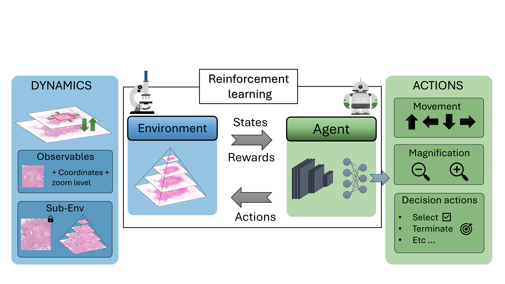
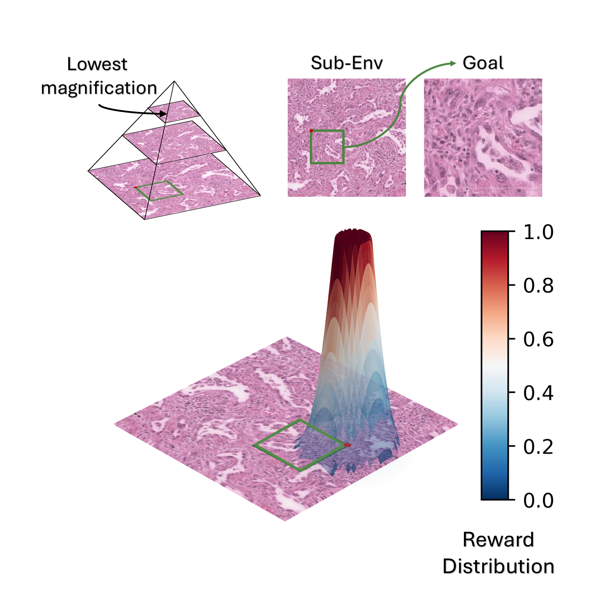

# HistoRL

**HistoRL** provides a histopathology-specific reinforcement learning (RL) environment designed to facilitate research and development in the domain.

---

## Main Components

### **Base_Env**
The `Base_Env` file introduces the foundational `Base` class, serving as the core of HistoRL. It includes:

- Implementation of basic **reset** and **step** functions.
- Abstract methods to define states, actions, and reward specifications.
- Framework for integrating downstream environment-specific logic, such as:
  - Reward calculation.
  - Goal generation.
  - Episode termination.
  - Integration of these mechanisms within `step` and `reset` workflows.

`Base_Env` collaborates with the `Observation` class to handle environment dynamics, forming the backbone of HistoRL.

---

### **Observation**
The `Observation` component provides two key functionalities:

1. **General Observation Class:**
   - A memory-efficient class enabling navigation within Whole Slide Images (WSIs).
2. **Memory-Mapped Observation:**
   - Optimized for speed and designed to handle sub-environments of WSIs.
   - Its functionality is limited to pre-mapped regions of the WSI.

**Key Features**:
- Implements movement, zooming, and bounding region management within WSI environments.
- Enhances environment dynamics through efficient handling of observations.

### **Reward**
The `Reward` class serves as a flexible base for reward computation. It can be extended to include custom reward calculation methods. Currently, it supports reward mechanisms for the **self-supervised task** described in:

---

### **SSL_Env**
The `SSL_Env` (Self-Supervised Learning Environment) is a toy, goal-conditioned environment built on top of `Base_Env`. It facilitates a localization task, as described in [Renal Cell Carcinoma subtyping: learning from multi-resolution localization]([https://example.com/your-paper-url](https://arxiv.org/abs/2411.09471)).

---

### **Utils**
The `utils` file contains common and general functionalities to support the environment

---

This structure ensures flexibility for various applications in histopathology research while maintaining computational efficiency.

---

Let us know if you encounter issues or have feature suggestions! 😊
